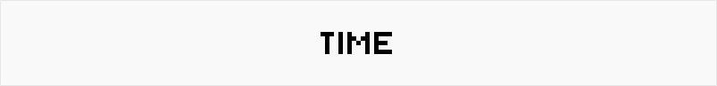

## Project Overview

Welcome to **TIME**! This cutting-edge, meticulously engineered application provides users with a seamless and instantaneous view of the current timestamp. It’s not just a simple date and time app—it's a testament to the precision, efficiency, and elegance in real-time data rendering.

## Table of Contents
- [Project Overview](#project-overview)
- [Table of Contents](#table-of-contents)
- [Features ](#features-)
- [Architecture Overview ](#architecture-overview-)
  - [Flow Diagram:](#flow-diagram)
- [Accessing TIME ](#accessing-time-)
  - [Interaction:](#interaction)
- [Troubleshooting ](#troubleshooting-)
- [FAQs ](#faqs-)
- [Supported Time Formats ](#supported-time-formats-)
- [License ](#license-)

## Features 

- **Real-time Rendering**: Displays the current timestamp with second accuracy.
- **High Precision**: Synchronizes directly with system time for reliability.
- **Responsive Design**: Optimized for any device, from mobile phones to large desktop screens.
- **Minimalist Interface**: Sleek, distraction-free UI for a focused user experience.
- **Scalable Architecture**: Can handle an unexpected surge of users without latency.
- **Cross-Browser Compatibility**: Tested and verified across major web browsers.
- **Style personalization**: You can now personalize the colors as you want !

## Architecture Overview 

This web application is built using a sophisticated combination of modern web technologies:

- **Frontend**: Vanilla JavaScript, HTML5, and CSS3 to create a lightweight, yet robust, interface.
- **Backend (Optional)**: While primarily designed as a static client-side application, it supports future extensions with Node.js or server-side rendering for API-driven timestamp synchronization.
- **Deployment**: Can be deployed on platforms such as Vercel, Netlify, or hosted on a static web server like Nginx.

### Flow Diagram:
1. **Client Request** → 2. **JavaScript Timer Initialization** → 3. **Current Timestamp Rendered**.

## Accessing TIME 

Accessing **TIME** is effortless and requires no installation. Experience the seamless, real-time display of the current timestamp by simply following this link:

👉 [**View TIME**](https://antmrlt.github.io/TIME) 

No setup, no hassle—just instant access to the current moment.

### Interaction:
- **Refresh** the page to resync the timestamp, if needed.
- Compatible with major browsers such as Chrome, Firefox, Edge, and Safari.

## Troubleshooting 

**Common Issues:**
- **Timestamp not displaying**: Ensure JavaScript is enabled in your browser.
- **Lagging timestamp**: Verify your device’s system time settings.
- **Compatibility warnings**: Check that you are running the application in a supported browser.

## FAQs 

**How much time did it take to create this application?**  
Creating this application took a considerable amount of time, involving meticulous engineering and thoughtful design. Every aspect, from the precision of the timestamp display to the simplicity of the user interface, was crafted with care to ensure an exceptional user experience.

## Supported Time Formats 

**TIME** supports the following time formats:

- **UNIX Time**
- **US Time (12-hour format)**
- **European Time (24-hour format)**  
- **ISO 8601**
- **RFC 1123**  
- **Military Time (24-hour format)**

Each of these formats ensures compatibility with different regional and international standards, making **TIME** adaptable to diverse use cases and user preferences.

## License 

This project is licensed under the MIT License. You are free to use, modify, and distribute it as long as the original author is credited.
